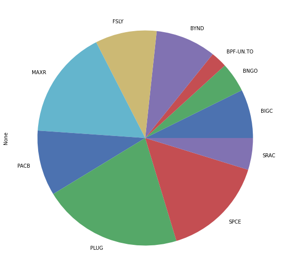

# Portfolio_Management_Practice
1. A few practices manage portfolios using modern portfolio theory in python notebooks. Realized using https://pypi.org/project/pyportfolioopt/.
Stocks selected are what I deem potential in the years to come.
Strategies discussed:  Global Minimum Volatility, Max Sharpe Ratio, Max quadratic utility, Risk Parity, Market Neutral, Transaction cost

2. Black-Litterman Allocation: a Bayesian approach to integrate expected returm (posterior) with prior return which is adjusted using initial estimation view and confidence level.

- Prepare data for the Black-Litterman model
- Constructing the prior return vector based on market equilibrium
- Constructing the Views/uncertainty
- Combining Black-Litterman with mean-variance optimisation

|           	|    Prior 	| Posterior 	| Views 	|
|----------:	|---------:	|----------:	|------:	|
| BIGC      	| 0.587003 	| 0.441304  	| 0.40  	|
| BNGO      	| 0.220198 	| 0.368854  	| 0.50  	|
| BPF-UN.TO 	| 0.110354 	| 0.140189  	| 0.20  	|
| BYND      	| 0.548225 	| 0.389248  	| 0.35  	|
| FSLY      	| 0.751493 	| 0.473828  	| 0.35  	|
| MAXR      	| 0.363306 	| 0.682402  	| 0.85  	|
| PACB      	| 0.481626 	| 0.483393  	| 0.55  	|
| PLUG      	| 1.536794 	| 0.972634  	| 0.40  	|
| SPCE      	| 0.651732 	| 0.677257  	| 0.80  	|
| SRAC      	| 0.224363 	| 0.299798  	| 0.40  	|

If jupyter notebook cannot be reviewed, please try paste the link into https://nbviewer.jupyter.org/.
